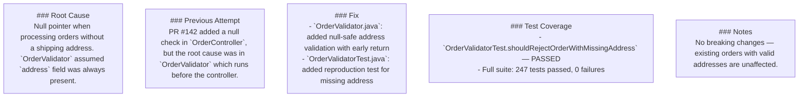

Example bug fix PR descriptions — follow this structure and brevity:

```mermaid
flowchart TD
    E1["### Root Cause<br/>Null pointer when processing orders without a shipping address. `OrderValidator` assumed `address` field was always present."]
    E2["### Previous Attempt<br/>PR #142 added a null check in `OrderController`, but the root cause was in `OrderValidator` which runs before the controller."]
    E3["### Fix<br/>- `OrderValidator.java`: added null-safe address validation with early return<br/>- `OrderValidatorTest.java`: added reproduction test for missing address"]
    E4["### Test Coverage<br/>- `OrderValidatorTest.shouldRejectOrderWithMissingAddress` — PASSED<br/>- Full suite: 247 tests passed, 0 failures"]
    E5["### Notes<br/>No breaking changes — existing orders with valid addresses are unaffected."]
```
