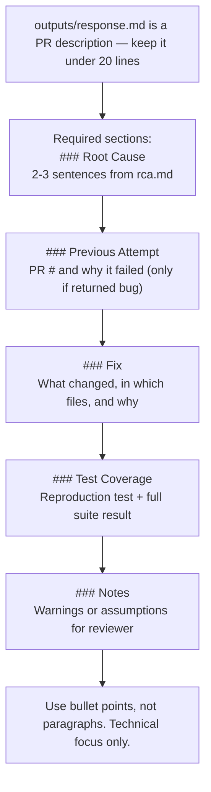

```mermaid
flowchart TD
    F1["outputs/response.md is a PR description — keep it under 20 lines"]
    F2["Required sections:<br/>### Root Cause<br/>2-3 sentences from rca.md"]
    F3["### Previous Attempt<br/>PR # and why it failed (only if returned bug)"]
    F4["### Fix<br/>What changed, in which files, and why"]
    F5["### Test Coverage<br/>Reproduction test + full suite result"]
    F6["### Notes<br/>Warnings or assumptions for reviewer"]
    F7["Use bullet points, not paragraphs. Technical focus only."]
    F1 --> F2 --> F3 --> F4 --> F5 --> F6 --> F7
```
