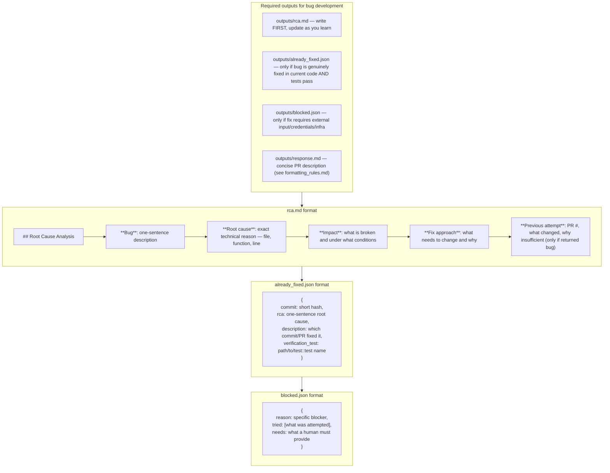

```mermaid
flowchart TD
    subgraph OUTPUTS["Required outputs for bug development"]
        O1["outputs/rca.md — write FIRST, update as you learn"]
        O2["outputs/already_fixed.json — only if bug is genuinely fixed in current code AND tests pass"]
        O3["outputs/blocked.json — only if fix requires external input/credentials/infra"]
        O4["outputs/response.md — concise PR description (see formatting_rules.md)"]
    end

    subgraph RCA["rca.md format"]
        R1["## Root Cause Analysis"]
        R2["**Bug**: one-sentence description"]
        R3["**Root cause**: exact technical reason — file, function, line"]
        R4["**Impact**: what is broken and under what conditions"]
        R5["**Fix approach**: what needs to change and why"]
        R6["**Previous attempt**: PR #, what changed, why insufficient (only if returned bug)"]
        R1 --> R2 --> R3 --> R4 --> R5 --> R6
    end

    subgraph ALREADY["already_fixed.json format"]
        A1["{<br/>commit: short hash,<br/>rca: one-sentence root cause,<br/>description: which commit/PR fixed it,<br/>verification_test: path/to/test::test name<br/>}"]
    end

    subgraph BLOCKED["blocked.json format"]
        B1["{<br/>reason: specific blocker,<br/>tried: [what was attempted],<br/>needs: what a human must provide<br/>}"]
    end

    OUTPUTS --> RCA --> ALREADY --> BLOCKED
```
