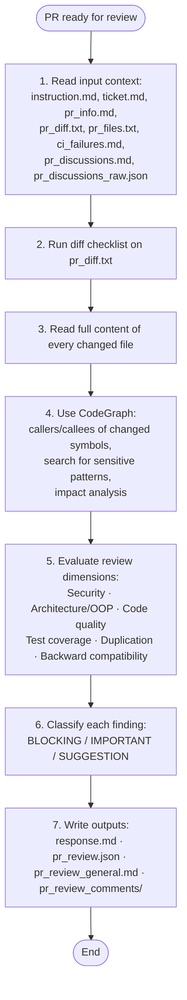

# PR Review General Guidelines

## Review flow

## 1. Input context

Read everything prepared in `input/TICKET/` first. Do not re-fetch external data that is already local.

## 2. Diff checklist — apply to `pr_diff.txt`

For every hunk, ask at least these questions:

- [ ] Does the change match the ticket scope? Any scope creep?
- [ ] Are new or changed public APIs contract-safe for existing callers?
- [ ] Is user/external input validated, sanitized, or escaped?
- [ ] Are secrets, tokens, or PATs handled safely — not logged, not interpolated into shell scripts?
- [ ] Is platform-specific code guarded (`kIsWeb`, `Platform.isX`)?
- [ ] Are async state changes followed by `notifyListeners()`?
- [ ] Does any workspace state reuse `previousViewModel.repository` instead of fresh state?
- [ ] Are new or modified files present under `testing/` in a non-test-automation PR?
- [ ] Is dead code, unused imports, or obvious duplication introduced?
- [ ] Are error paths handled, or are failures silently swallowed?
- [ ] Are new dependencies justified and compatible with the existing stack?

## 3. Changed-file deep read

Do not review from the diff alone. Read the full content of every changed file:

- imports and dependencies
- class/method responsibilities and adherence to SRP / OOP principles
- naming consistency with the rest of the codebase
- error handling, logging, and edge cases
- test coverage for changed behavior
- backward-compatibility and migration impact

## 4. CodeGraph risk search (mandatory)

Use CodeGraph to move from "what changed" to "what could break":

- `codegraph_callers` / `codegraph_callees` on every new or modified public function, class, or exported symbol
- `codegraph_search` for sensitive patterns such as: `PAT_TOKEN`, `secrets.`, `vars.`, `Process.run`, `File(`, `github.ref`, `github.token`, `previousViewModel`
- `codegraph_impact` before flagging any architectural or contract change

If CodeGraph is unavailable, use `grep` / `rg` / `git grep` equivalents and document the search in your notes.

## 5. Review dimensions

Rate the PR across all relevant dimensions:

| Dimension | What to check |
|---|---|
| **Security** | injection, unsafe interpolation, secret leakage, missing permissions, unsafe defaults |
| **Architecture / OOP** | SRP, coupling, abstraction consistency, provider/repository boundaries |
| **Code quality** | naming, complexity, error handling, logging, comments |
| **Tests** | coverage for new/changed paths, meaningful assertions, no brittle string-only tests |
| **Duplication** | copy-paste, duplicated logic across files, duplicated configuration |
| **Backward compatibility** | public API changes, migration paths, default behavior |
| **Performance** | unnecessary rebuilds, heavy sync operations, missing timeouts |
| **Workflow / CI safety** | (when `.github/workflows/` changes) secret declarations, ref pinning, permissions, timeouts |

## 6. Severity classification

Classify every finding before writing outputs:

- **BLOCKING** — merge would cause a bug, security issue, data loss, or CI break. Must be fixed.
- **IMPORTANT** — real maintainability or correctness issue. Strongly prefer fixing before merge.
- **SUGGESTION** — optional improvement, style, or future polish. Does not block merge.

When in doubt, start one level higher; downgrade only after confirming the risk is negligible.

## 7. Outputs

Write the standard review artifacts:

- `outputs/response.md` — concise summary, key issues, next steps
- `outputs/pr_review.json` — structured data with `recommendation`, `summary`, `inlineComments`, `issueCounts`
- `outputs/pr_review_general.md` — 1-2 paragraph general PR comment
- `outputs/pr_review_comments/*.md` — one file per inline comment
