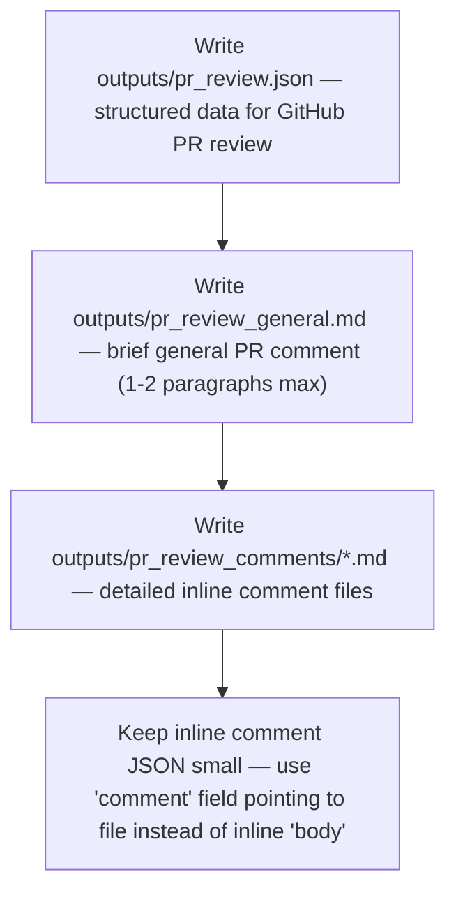

```mermaid
flowchart TD
    O1["Write outputs/pr_review.json — structured data for GitHub PR review"]
    O2["Write outputs/pr_review_general.md — brief general PR comment (1-2 paragraphs max)"]
    O3["Write outputs/pr_review_comments/*.md — detailed inline comment files"]
    O4["Keep inline comment JSON small — use 'comment' field pointing to file instead of inline 'body'"]
    O1 --> O2 --> O3 --> O4
```
