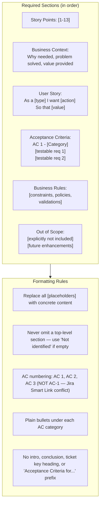

# Enhanced Story Template Guidelines

The block below is a **structural template / example only**. The tags such as `<bold>`, `<bullet>`, and `<heading2>` are placeholders that show the required shape of the document.

**CRITICAL: Never write the final `outputs/response.md` using these literal metatags.** Use the tracker-specific transformation table (for example `agents/instructions/tracker/jira_markup_transform.md` when the tracker is Jira) to convert every placeholder into the correct tracker markup.

## Rules

- The template above is a structural example. Replace every `<bold>`, `<italic>`, `<strike>`, `<underline>`, `<code>`, `<codeblock>`, `<bullet>`, `<numbered>`, `<heading1>`, `<heading2>`, `<heading3>`, `<link>`, `<image>`, `<quote>`, `<panel>`, `<color>`, and `
` placeholder with the equivalent markup defined in the tracker-specific transformation table.
- Do NOT leave literal XML-style tags such as `<bold>` or `<code>` in the final `outputs/response.md`.
- Do NOT use Markdown syntax in Jira output: no `**bold**`, no `- item` bullets, no `# headings`, no triple backticks.
- Use the tracker-specific link format when referencing tickets or URLs.

**IMPORTANT**: Read `input/existing_questions.json` for answered questions as context. Use `dmtools` CLI commands for full ticket details.

**IMPORTANT**: Check child tickets and parent story for better context using the appropriate `dmtools` search command.
