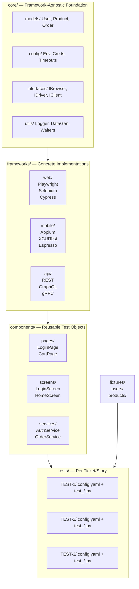
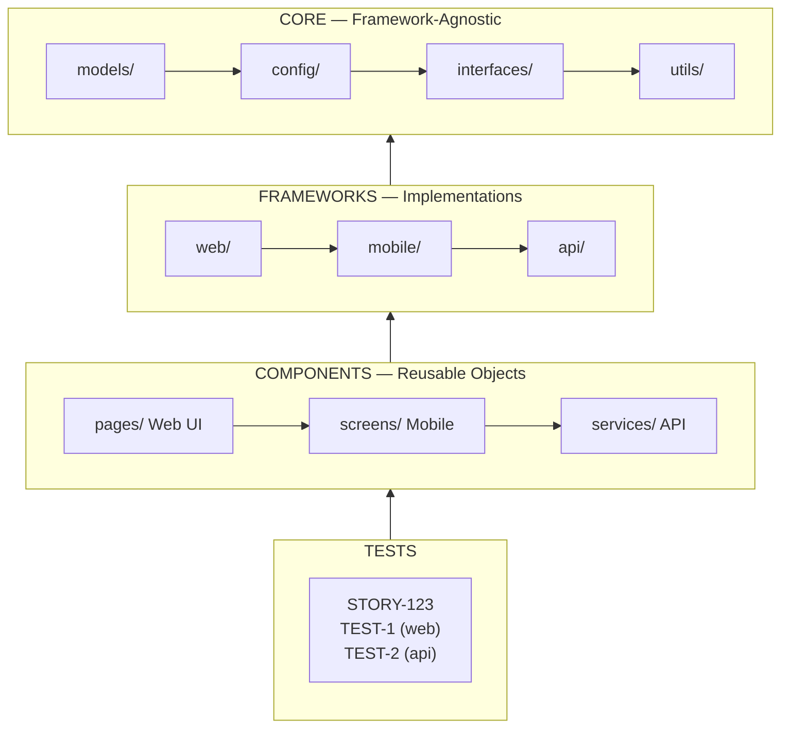
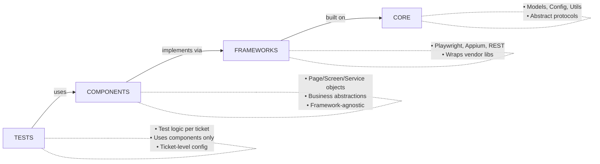
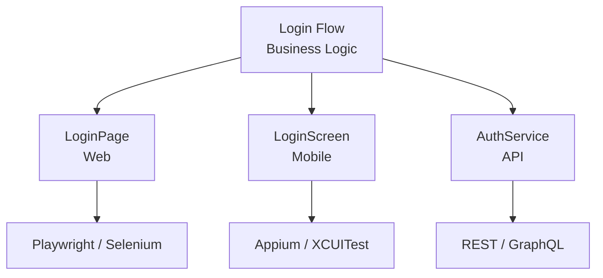

# Test Automation Architecture

## High-Level Structure



## Architecture Diagram



## Layer Responsibilities



## Test Configuration Per Ticket

```yaml
# tests/TEST-1/config.yaml
test_id: TEST-1
type: web | mobile | api
framework: playwright | appium | rest
platform: chrome | ios | android
dependencies: [TEST-0]
```

## Cross-Platform Component Sharing



## Key Principles

| Principle | Description |
|-----------|-------------|
| **Separation** | Tests don't know about frameworks, only components |
| **Abstraction** | Components use interfaces, not concrete implementations |
| **Flexibility** | Easy to swap frameworks without changing tests |
| **Reusability** | Same business logic, different platforms |
| **Isolation** | Each test ticket has its own config and dependencies |

## OOP & Modern Practices

**Apply OOP throughout all test code:**
- **Single Responsibility** — each Page/Screen/Service object handles one domain area only
- **Dependency Injection** — pass drivers, clients, and config via constructor; never instantiate them inside components
- **Interfaces first** — all components implement contracts defined in `core/interfaces/`; tests depend on interfaces, not concrete classes
- **Encapsulation** — expose only high-level actions (e.g. `loginPage.loginAs(user)`), never raw selectors or HTTP internals

**Use modern, idiomatic frameworks:**
- **Web**: prefer Playwright over Selenium for new tests (async, reliable, built-in waits)
- **API**: use typed API clients with models — no raw `requests.get(url)` calls inline in tests
- **Mobile**: use Appium with Page Object Model; no hardcoded locators outside Screen classes
- **Assertions**: use framework-native matchers (e.g. `expect(locator).toBeVisible()`) — not manual boolean checks

**Test code quality:**
- No hardcoded URLs, credentials, or environment values — use `core/config/`
- No logic duplication — extract shared flows into components
- Tests must be deterministic: no `time.sleep()`, use explicit waits instead
