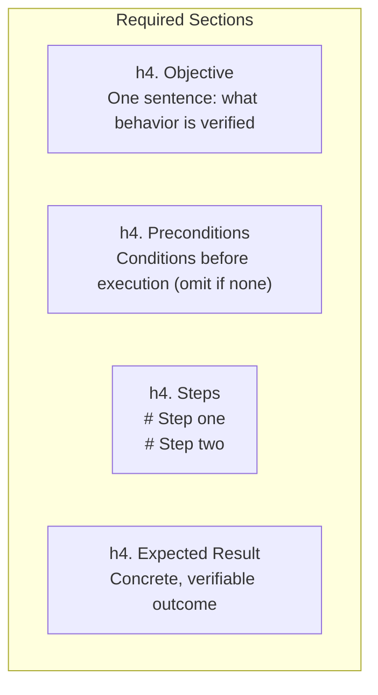
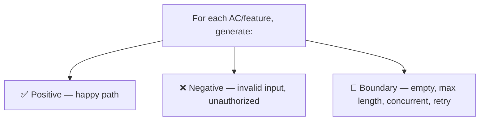
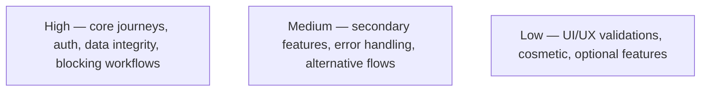
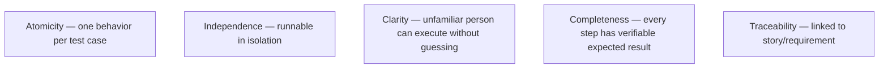
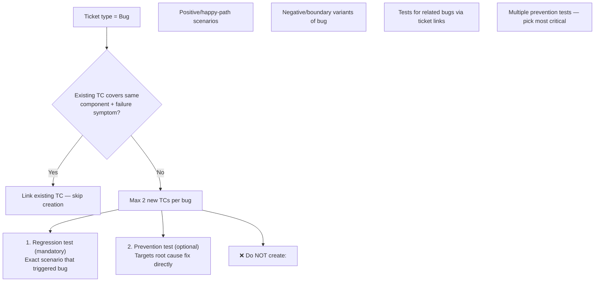
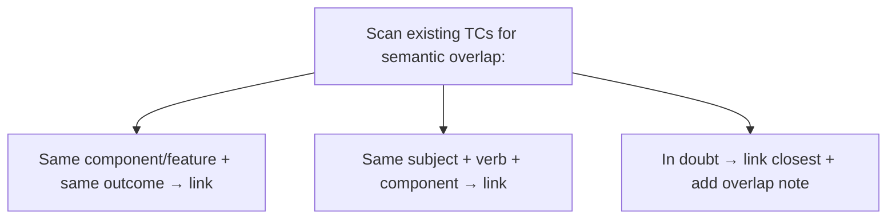

# Test Case Creation Rules

## Naming

Format: *Test: [Action or Feature] — [Expected Outcome]*

Examples:
- Test: Create Jira ticket via AI agent — ticket created with correct fields
- Test: Run agent with WIP label present — processing skipped, comment posted

## Structure

## Coverage

## Priority

## Quality Rules

## Scope

Cover:
- All acceptance criteria in the story
- Main integration points (tracker, SCM, AI providers)
- Error handling and failure scenarios
- Security-relevant behaviors (permissions, tokens, unauthorized access)

## Bug Test Cases — Strict Limits

## Deduplication (mandatory before creating)

